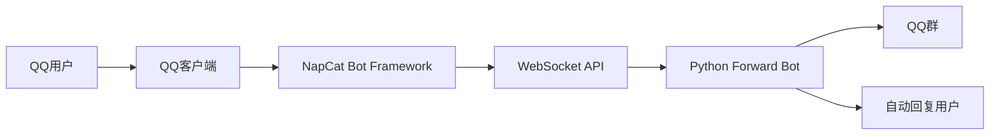
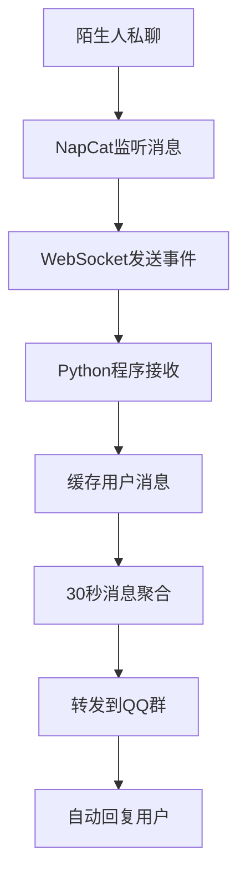

# JZXBot

一个基于 **NapCat + WebSocket + Python** 的 QQ 私聊消息转发机器人。

该机器人可以监听 **陌生人私聊消息**，将消息 **30秒聚合后转发到指定QQ群**，并 **自动回复用户**。

适用于：

- QQ客服系统
- QQ社群引流
- 自动消息归档
- 客服集中处理

---

# ✨ 功能

- 📩 监听陌生人私聊
- ⏱ 30秒消息聚合
- 📤 自动转发QQ群
- 🤖 自动回复用户
- 🔁 WebSocket断线自动重连
- 🧩 Python插件式逻辑

---

# 🏗 系统架构



---

# 🔄 工作流程



---

# 📂 项目结构

```
QQ-Forward-Bot
│
├─ forward.py        # 主程序
├─ requirements.txt  # Python依赖
├─ README.md         # 项目文档
```

---

# ⚙ 环境要求

- Python 3.9+
- NapCat
- QQ客户端

---

# 📥 安装 NapCat

NapCat 官网：

```
https://napneko.github.io
```

下载并运行。

登录 QQ：

```
扫码登录
```

---

# 🔧 开启 WebSocket

打开 NapCat 控制台：

```
http://127.0.0.1:6099
```

进入：

```
系统设置 → WebSocket
```

开启：

```
WebSocket Server
```

记录地址：

```
ws://127.0.0.1:3001
```

记录 Token：

```
your_token
```

---

# 🐍 安装 Python 依赖

创建 requirements.txt

```
websockets
requests
```

安装：

```bash
pip install -r requirements.txt
```

如果报错：

```
No module named websockets
```

运行：

```bash
python -m pip install websockets
```

---

# 🚀 启动机器人

运行：

```bash
python forward.py
```

---

# 🧠 机器人逻辑

机器人核心逻辑：

1️⃣ 监听私聊消息

2️⃣ 缓存用户消息

3️⃣ 30秒聚合消息

4️⃣ 转发QQ群

5️⃣ 自动回复用户

---

# 🧾 核心代码示例

```python
import asyncio
import websockets
import json
import time
import requests

WS_URL = "ws://127.0.0.1:3001"
TOKEN = "your_token"

GROUP_ID = 123456
HTTP_URL = "http://127.0.0.1:3000"

buffers = {}

async def main():
    async with websockets.connect(
        WS_URL,
        extra_headers={"Authorization": f"Bearer {TOKEN}"}
    ) as ws:

        while True:
            msg = await ws.recv()
            data = json.loads(msg)

            if data["post_type"] == "message":
                user_id = data["user_id"]
                text = data["raw_message"]

                if user_id not in buffers:
                    buffers[user_id] = {
                        "messages": [],
                        "time": time.time()
                    }

                buffers[user_id]["messages"].append(text)
```

---

# 📬 自动回复示例

```python
def reply_user(user_id, text):

    url = HTTP_URL + "/send_private_msg"

    requests.post(url, json={
        "user_id": user_id,
        "message": text
    })
```

---

# 🔁 自动重连逻辑

```python
while True:
    try:
        asyncio.run(main())
    except Exception as e:
        print("断开连接，5秒重连:", e)
        time.sleep(5)
```

---

# 📊 消息聚合逻辑

```
用户消息1
用户消息2
用户消息3
      ↓
30秒后
      ↓
合并消息
      ↓
发送QQ群
```

示例：

```
用户QQ:123456

你好
有人吗
我想咨询
```

---

# 🛠 常见问题

### WebSocket连接失败

检查：

```
NapCat是否启动
WebSocket是否开启
Token是否正确
```

---

### Python报错

```
ModuleNotFoundError: websockets
```

解决：

```
pip install websockets
```

---

# 📜 License

MIT License

---

# ⭐ Star History

如果这个项目对你有帮助，欢迎点个 ⭐
